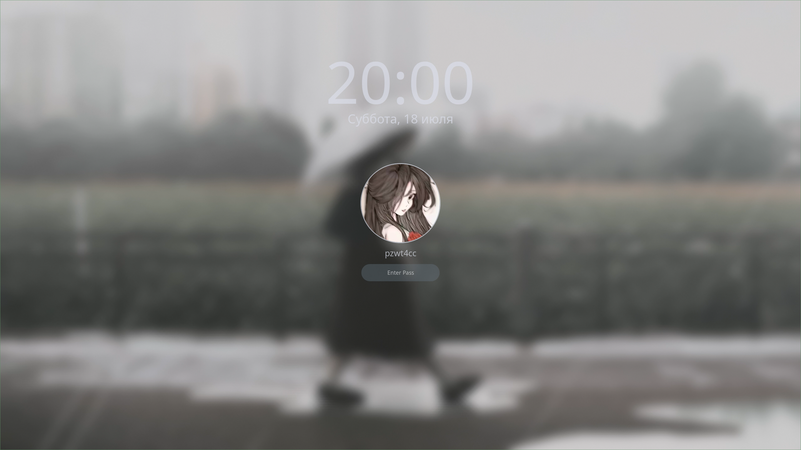

# aeonshell

<p align="center">
  
</p>

A Wayland desktop for **Hyprland**, built with **Quickshell**. Change your
wallpaper and the whole UI — bar, control center, launcher, notifications,
even the lock screen — repaints itself to match, powered by **pywal**.

https://github.com/user-attachments/assets/5c14767b-d2c9-4ad7-b5de-51701005499c

---

## Features

- Top bar — workspaces, clock, tray, audio/network/bluetooth, media player
- Control center — wifi, bluetooth, audio, weather widget (Open-Meteo, no API key needed)
- App launcher with a built-in wallpaper picker — type `>wallpaper` to browse
  and apply wallpapers right from the launcher, no external app needed
- Notification center with popups (urgency styling, grouping, DND toggle)
- Screenshot tool + clipboard history, both on hotkeys
- Power menu — lock, exit Hyprland, suspend, reboot, power off
- Wallpaper changes → entire theme updates automatically via pywal
- Matching lock screen (Hyprlock)

| Desktop                           | Control center                                      |
| ----------------------------- | --------------------------------------------------- |
|  |  |

| Launcher                                | Notifications                                     |
| --------------------------------------- | ------------------------------------------------- |
|  |  |



---

## What's where

- `hypr/` — Hyprland config (compositor, keybinds, autostart)
- `quickshell/` — the shell itself (bar, popups, everything you see)
- `fastfetch/`, `kitty/` — terminal setup (banner, terminal)
- `zsh/` — optional, feel free to keep your own shell instead

---

## Install

### Option A: automated install script

Try this first — it checks you're on Arch, installs everything below
(pacman + AUR via `yay`, installing `yay` itself if you don't have it),
copies the configs into place, and offers to back up any existing
`~/.config/hypr` (etc.) it finds before touching anything.

```bash
git clone https://github.com/pzwt4cc/aeonshell
cd aeonshell
./install.sh
```

It's interactive — it'll ask before overwriting existing configs and
before installing optional extras, so it's safe to just run and follow
the prompts.

### Option B: manual install

If you'd rather see exactly what's happening, or the script doesn't fit
your setup, here's the same thing done by hand.

```bash
git clone https://github.com/pzwt4cc/aeonshell
cd aeonshell

mkdir -p ~/.config/{hypr,quickshell,fastfetch,kitty}
cp -r hypr/. ~/.config/hypr/
cp -r quickshell/. ~/.config/quickshell/
cp -r fastfetch/. ~/.config/fastfetch/
cp -r kitty/. ~/.config/kitty/
cp hypr/conf/local.conf.example ~/.config/hypr/conf/local.conf
cp zsh/.zshrc zsh/.p10k.zsh zsh/.zsh_plugins.txt ~/

# Hyprland calls these scripts directly (exec/bind), so they need the
# executable bit.
chmod +x ~/.config/hypr/script/*.sh
```

### What to install

**Official repos:**

```bash
sudo pacman -S --needed \
  hyprland hyprlock xdg-desktop-portal-hyprland xdg-desktop-portal \
  qt6-wayland qt6ct qt6-5compat gtk3 kitty pcmanfm-qt xorg-xrandr \
  networkmanager network-manager-applet nm-connection-editor \
  bluez bluez-utils blueman \
  pipewire pipewire-pulse pipewire-alsa wireplumber pavucontrol \
  wl-clipboard cliphist grim slurp swappy \
  jq curl python zenity inotify-tools udiskie \
  fastfetch fzf yazi tty-clock
```

> `qt6-5compat` provides the `Qt5Compat.GraphicalEffects` QML module the shell
> uses for shadows/blur, and `gtk3` provides `gtk-launch`, which the app
> launcher uses to start apps. Neither is pulled in automatically by
> `quickshell-git`, so they need to be installed explicitly.

Want zsh as your shell? Install it separately — skip this if you'd rather
keep your current shell:

```bash
sudo pacman -S zsh
```

**AUR** (via `yay`/`paru`):

```bash
yay -S --needed \
  quickshell-git awww python-pywal \
  zen-browser-bin bibata-cursor-theme \
  otf-font-awesome ttf-jetbrains-mono-nerd zsh-antidote \
  kvantum gpu-screen-recorder-ui peazip xfce4-mousepad
```

> `awww` is the wallpaper daemon the launcher's `>wallpaper` picker drives
> directly (plus `wal` from `python-pywal` for re-theming) — you don't need
> waypaper, swww, or any other separate wallpaper app.

Optional, install only if you use them:

```bash
sudo pacman -S openrgb
```

```bash
yay -S codium thunderbird localsend
```

---

## Set up

1. Copy `hypr/conf/local.conf.example` → `hypr/conf/local.conf` and edit it
   for your machine (monitors, GPU, autostart entries — comments inside
   explain each part).
2. Drop a few images into `~/Pictures/Wallpapers` — it's created
   automatically on first launch if it doesn't exist.
3. Open the **app launcher**, type `>` to enter command mode, then
   `wallpaper` to browse and apply one. This also generates your first
   pywal color theme — everything re-colors from here on automatically
   whenever you switch wallpapers.
4. Set your avatar and weather city from aeonshell's settings window
   (optional) — saved to `~/.config/quickshell/avatar.png` and
   `~/.config/quickshell/weather_city.conf` respectively.
5. Launch Hyprland — everything else starts on its own.
6. If you're using zsh as your shell: `chsh -s $(which zsh)`. Plugins
   install themselves on first launch.

Screen recording is handled by `gsr-ui` (starts automatically) rather than
a hotkey script — open it from its tray icon or app launcher entry.

### Shell settings

Bar position, tray/player visibility, notification grouping, and
edge-to-edge mode are all changeable from the settings window and save
automatically to `~/.config/hypr/conf/quickshell.conf` — it's fully
rewritten on every change, so there's no need to edit it by hand. If you
want future custom keybinds to live in the same file, source it once from
`hyprland.conf`:

```
source = ~/.config/hypr/conf/quickshell.conf
```

As with any setup, your default file manager, browser, and so on can be
set once near the top of `~/.config/hypr/conf/bind.conf`.

---

## License

MIT — see [LICENSE](./LICENSE).

---

---

# RU - aeonshell

Wayland-окружение для **Hyprland**, собранное на **Quickshell**.
Кратко: при смене обоев — вся оболочка перекрашивается вслед за ними: панель, центр
управления, лаунчер и тд., всё через **pywal**.

---

## Имеется:

- Верхняя панель — рабочие столы, часы, трей, аудио/сеть/bluetooth, медиаплеер
- Центр управления — wifi, bluetooth, звук, виджет погоды (Open-Meteo, без API-ключа)
- Лаунчер приложений со встроенным выбором обоев — ввод `>wallpaper`,
  чтобы посмотреть и применить обои прямо из лаунчера, без сторонних приложений
- Центр уведомлений с всплывающими попапами
- Инструмент скриншотов + история буфера обмена, оба по горячим клавишам
- Меню питания — блокировка, выход из Hyprland, сон, перезагрузка, выключение
- Смена обоев → вся тема обновляется автоматически через pywal
- Экран блокировки (Hyprlock)

---

## Места файлов конфигурации

- `hypr/` — конфиг Hyprland (компоситор, биндинги, автозапуск)
- `quickshell/` — сама оболочка (панель, попапы, всё, что видно на экране)
- `fastfetch/`, `kitty/` — настройка терминала
- `zsh/` - опционально, можно оставить ваш шелл

---

## Установка

### Вариант А: автоустановка скриптом

Попробуйте сначала это — скрипт проверяет, что система на Arch,
ставит все зависимости ниже (pacman + AUR через `yay`, при этом сам
`yay` тоже поставит, если его нет), копирует конфиги на место и
предлагает забэкапить уже существующий `~/.config/hypr` (и т.д.),
прежде чем что-либо трогать.

```bash
git clone https://github.com/pzwt4cc/aeonshell
cd aeonshell
./install.sh
```

Скрипт интерактивный — спросит перед перезаписью существующих
конфигов и перед установкой опциональных пакетов, так что его можно
просто запустить и следовать подсказкам.

### Вариант Б: ручная установка

Если хотите видеть каждый шаг своими глазами, или скрипт не подошёл
под вашу систему — вот то же самое руками.

```bash
git clone https://github.com/pzwt4cc/aeonshell
cd aeonshell

mkdir -p ~/.config/{hypr,quickshell,fastfetch,kitty}
cp -r hypr/. ~/.config/hypr/
cp -r quickshell/. ~/.config/quickshell/
cp -r fastfetch/. ~/.config/fastfetch/
cp -r kitty/. ~/.config/kitty/
cp hypr/conf/local.conf.example ~/.config/hypr/conf/local.conf
cp zsh/.zshrc zsh/.p10k.zsh zsh/.zsh_plugins.txt ~/

# Hyprland вызывает эти скрипты напрямую (exec/bind), поэтому им нужен
# бит исполнения.
chmod +x ~/.config/hypr/script/*.sh
```

### Установка зависимостей

**Из официальных репозиториев:**

```bash
sudo pacman -S --needed \
  hyprland hyprlock xdg-desktop-portal-hyprland xdg-desktop-portal \
  qt6-wayland qt6ct qt6-5compat gtk3 kitty pcmanfm-qt xorg-xrandr \
  networkmanager network-manager-applet nm-connection-editor \
  bluez bluez-utils blueman \
  pipewire pipewire-pulse pipewire-alsa wireplumber pavucontrol \
  wl-clipboard cliphist grim slurp swappy \
  jq curl python zenity inotify-tools udiskie \
  fastfetch fzf yazi tty-clock
```

> `qt6-5compat` даёт QML-модуль `Qt5Compat.GraphicalEffects`, которым оболочка
> рисует тени/блюр, а `gtk3` даёт `gtk-launch`, через который лаунчер
> запускает приложения. Ни то, ни другое `quickshell-git` не тянет
> автоматически, так что их нужно ставить отдельно.

Установка zsh, если не нужен - пропустите

```bash
sudo pacman -S zsh
```

**Из AUR** (через `yay`/`paru`):

```bash
yay -S --needed \
  quickshell-git awww python-pywal \
  zen-browser-bin bibata-cursor-theme \
  otf-font-awesome ttf-jetbrains-mono-nerd zsh-antidote \
  kvantum gpu-screen-recorder-ui peazip xfce4-mousepad
```

> `awww` (он же swww, теперь awww) — демон обоев, которым лаунчер напрямую управляет через `>wallpaper`

Опционально:

```bash
sudo pacman -S openrgb
```

```bash
yay -S codium thunderbird localsend
```

---

## Настройка

1. Скопируй `hypr/conf/local.conf.example` (шаблон) → `hypr/conf/local.conf` (конфигурация которую загружает Hyprland)
   и отредактируй под себя (мониторы, GPU, автозапуск — внутри есть комментарии и прмиеры к каждой части).
2. Скинь несколько изображений в `~/Pictures/Wallpapers` — при первом
   запуске папка создаётся автоматически, если её нет.
3. Открой **лаунчер приложений**, набери `>`, чтобы войти в командный
   режим, затем `wallpaper` — выбери и примени обои. Заодно
   сгенерируется первая цветовая тема pywal — дальше всё перекрашивается
   само при каждой смене обоев.
4. Задай аватар и город для погоды в окне настроек aeonshell (по желанию)
   (сохраняются в `~/.config/quickshell/avatar.png` и `~/.config/quickshell/weather_city.conf` соответственно).
5. Запусти Hyprland — всё остальное стартует само.
6. При выборе zsh шеллом по умолчанию, сделай: `chsh -s $(which zsh)`. Плагины
   ставятся сами при первом запуске.

Запись экрана делает `gsr-ui` (стартует автоматически)
открывай его из иконки в трее или из лаунчера приложений (так же в нём имеются встроенные горячие клавиши).

### Настройки шелла

Положение панели, видимость трея/плеера, группировка уведомлений и
режим edge-to-edge меняются прямо из окна настроек и сохраняются
автоматически в `~/.config/hypr/conf/quickshell.conf` — файл полностью
перезаписывается при каждом изменении, редактировать его руками НЕ
нужно. Этот файл уже прописан в `hyprland.conf`:

```
source = ~/.config/hypr/conf/quickshell.conf
```

Как и в обычных сборках, настроить по-умолчанию файловый менеджер, браузер и прочее
можно один раз в `~/.config/hypr/conf/bind.conf` в самом начале.

---

## Лицензия

MIT — см. [LICENSE](./LICENSE).
